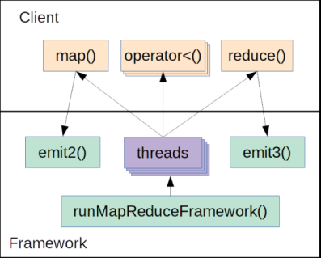

# Map-Reduce
Multi Thread Programming

## High Level Overview
Performance is the major motivation for multi-threaded programming. Multiple processors can
execute multiple threads at the same time and do the same amount of computations in less time
than it will take a single processor.
Two challenges complicate multi-threaded programming:
* In many cases it is difficult to split the big task into small parts that can run in parallel.
*  Running in multiple threads requires synchronisation and communication between threads.
This introduces an overhead which without careful design can increase the total runtime
significantly.

MapReduce is used to parallelise tasks of a specific structure. Such tasks are defined by two
functions, map and reduce, used as follows:
1) The input is given as a sequence of elements.
2) `Map phase` The map function is applied to each input element, producing a sequence of
intermediary elements.
3) `Sort/Shuffle phases` The intermediary elements are sorted into new sequences (more on
this later).
4) `Reduce phase` The reduce function is applied to each of the sorted sequences of
intermediary elements, producing a sequence of output elements.
5) The output is a concatenation of all sequences of output elements.

#### Example
*counting character frequency in strings*
1) The input is a sequence of strings.
2) (Map phase) In each string we count how many times each character appears and then
produce a sequence of the results.
3) (Sort/Shuffle phases) We sort the counts according to the character, creating new
sequences in the process. Now for every character we have a sequence of all counts of this
character from all strings.
4) (Reduce phase) For each character we sum over its respective sequence and produce the
sum as a single output.
5) The output is a sequence of the sums.

## Design
The implementation of this design can be split into two parts:
* Implementing the functions map and reduce. The functions implementation will be
different for every task. We call this part the client.
* Implementing everything else – the partition into phases, distribution of work between
threads, synchronisation etc. This will be identical for different tasks. We call this part the
framework.
Using this split, we can code the framework once and then for every new task, we can just code
the significantly smaller and simpler client. In other words, after you have written the code for the
framework you can write different map and reduce function depending on the task you would like
to perform.
Constructing the framework is the main goal of this exercise and you will have to implement the
framework. In the next sections we will break this goal down into subgoals and provide a more
detailed design for you to implement.
  
### Client Overview
The client contains two main functions: **map** _and_ **reduce**.
Since the elements after the map and reduce function should have linear order, every element must
have a key that allows us to compare elements and sort them. For this reason, each element is
given as a pair `(key, value)`.
We have three types of elements, each having its own key type and value type:
* Input elements – we denote their key type k1 and value type v1.
* Intermediary elements – we denote their key type k2 and value type v2.
* Output elements – we denote their key type k3 and value type v3.

The map function receives a key of type k1 and a value of type v1 as input and produces pairs of
(k2, v2).
The framework sort/shuffle phase sort the intermediary elements that created by the map function
according to their keys and then create new sequences such that reduce will run exactly once for
each k2.
The reduce function receives a sequence of pairs (k2, v2) as input, where all keys are identical, and
produces pairs of (k3, v3).
A header MapReduceClient.h and a sample client are provided with this exercise.
SampleClient.cpp implement the counting characters frequency in strings example from TA6.
An implementation of a client header MapReduceClient.h contains the following:

1. Key/Value classes inheriting from K1, K2, K3 and V1, V2, V3 including a < operator for
the keys, to enable comparison between different elements.
2. The map function with the signature:
        
        void map(const K1* key, const V1* value, void* context) const

    This function will produce intermediate pairs and will add them to the framework
    databases using the framework function emit2(K2, V2, context).
   
3. The reduce function with the signature:
   
        void reduce(const IntermediateVec* pairs, void* context) const
    _note:_ IntermediateVec is of type std::vector< std::pair< K2*, V2* >>
   
    All pairs in the vector are expected to have the same key (but not necessarily the same
    instances of K2).
    This function will produce output pairs and will add them to the framework databases
    using the framework function emit3(K3, V3, context).
    The context argument is provided to allow emit3 to receive information from the function
    that called reduce.
    Pay attention that the map and reduce function are called within the framework and the
    input to these functions is passed by the framework.
   
### Framework Interface Overview

The framework will support running a MapReduce operations as an asynchrony job, together with
ability to query the current state of a job while it is running.

Two types of variables are used in the header to monitor MapReduce job:
1. `JobState` - a struct which quantize the state of a job, including:
    * stage_t stage – an enum (0-Undefined, 1-Map, 2-Shuffle, 3-Reduce)
    
    _note:_ We will save the job stage using that enum.
    The job should be at an undefined stage until the first thread starts the map
    phase.
    * float percentage – job progress of current stage (i.e., the percentage of elements that
    were processed out of all the elements that should be processed in the stage, number in
    the range of 0 to 100).
2. `JobHandle` – void*, an identifier of a running job. 
   
   Returned when starting a job and used by other framework functions (for example to get the state of a job).

The framework interface consists of **six** functions:

1) startMapReduceJob – This function starts running the MapReduce algorithm (with several
threads) and returns a JobHandle.
   
        JobHandle startMapReduceJob(const MapReduceClient& client, const InputVec& inputVec, OutputVec& outputVec, int multiThreadLevel);
    _client_ : The implementation of MapReduceClient or in other words the task that the framework should run.
   
    _inputVec_ : a vector of type std::vector<std::pair<K1*, V1*>>, the input elements.
   
    _outputVec_ : a vector of type std::vector<std::pair<K3*, V3*>>, to which the output
    elements will be added before returning. You can assume that outputVec is empty.
   
    _multiThreadLevel_ : the number of worker threads to be used for running the algorithm.
    You will have to create threads using c function pthread_create. You can assume
    multiThreadLevel argument is valid (greater or equal to 1).
   
    **_return_** : The function returns JobHandle that will be used for monitoring the job.

2) waitForJob – a function gets JobHandle returned by startMapReduceFramework and waits
until it is finished.

        void waitForJob(JobHandle job)

    _note:_ use function pthread_join.
   
    It is legal to call the function more than once and you should handle it.
    Pay attention that calling pthread_join twice from the same process has undefined behavior and you must
    avoid that.

3) getJobState – this function gets a JobHandle and updates the state of the job into the given
    JobState struct.
    
        void getJobState(JobHandle job, JobState* state)

4) closeJobHandle – Releasing all resources of a job. You should prevent releasing resources
    before the job finished. After this function is called the job handle will be invalid.
    
        void closeJobHandle(JobHandle job)
    In case that the function is called, and the job is not finished yet wait until the job is
    finished to close it.
   
    In order to release mutexes and semaphores (pthread_mutex, sem_t) you should use the
    functions pthread_mutex_destroy, sem_destroy.
   
5) emit2 – This function produces a (K2*, V2*) pair. It has the following signature:
    
        void emit2 (K2* key, V2* value, void* context)
   
    The function receives as input intermediary element (K2, V2) and context which contains
    data structure of the thread that created the intermediary element.
   
    The function saves the intermediary element in the context data structures. In addition, the function updates the
    number of intermediary elements using atomic counter.
   
    Please pay attention that emit2 is called from the client's map function and the context is
    passed from the framework to the client's map function as parameter.
   
6) emit3 – This function produces a (K3*, V3*) pair. It has the following signature:
    
        void emit3 (K3* key, V3* value, void* context)
    The function receives as input output element (K3, V3) and context which contains data
    structure of the thread that created the output element. The function saves the output
    element in the context data structures (output vector). In addition, the function updates the
    number of output elements using atomic counter.
   
    Please pay attention that emit3 is called from the client's map function and the context is
    passed from the framework to the client's map function as parameter.
